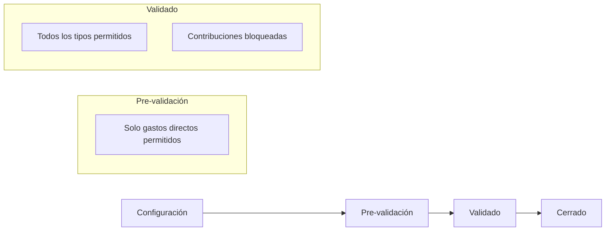

# Arquitectura del Sistema Dual-Flow Paralelo

> **Proyecto**: CuentasSiK - Sistema de gestión de gastos compartidos
> **Fecha**: Octubre 2025
> **Estado**: Diseño y planificación
> **Objetivo**: Sistema paralelo optimizado que aprovecha PostgreSQL avanzado

---

## 🎯 **VISIÓN GENERAL**

### Propósito del Sistema Paralelo

Crear un **sistema completamente nuevo y paralelo** que:

✅ **Coexiste** con el sistema actual sin afectarlo
✅ **Aprovecha** la nueva arquitectura de base de datos optimizada
✅ **Implementa** workflows guiados de 7 pasos mensuales
✅ **Optimiza** la experiencia de usuario para el flujo dual
✅ **Permite** migración gradual y eventual deprecación del sistema actual

### Principios de Diseño

1. **Separación Total**: `/app/dual-flow/` independiente de `/app/app/`
2. **Database-First**: Aprovechar ENUMs, materialized views, stored procedures
3. **Workflow-Driven**: UI guiada por el proceso mensual de 7 pasos
4. **Performance-Optimized**: Queries precomputadas y triggers automáticos
5. **Mobile-First**: Navegación simplificada de 5 tabs

---

## 🏗️ **ARQUITECTURA DE DIRECTORIOS**

### Estructura Nueva vs Existente

```
/app/
├── app/                           # 🔄 SISTEMA ACTUAL (NO TOCAR)
│   ├── layout.tsx                 # Layout existente con 7 tabs
│   ├── page.tsx                   # Dashboard actual
│   ├── expenses/                  # Sistema actual de gastos
│   ├── contributions/             # Sistema actual de contribuciones
│   ├── household/                 # Gestión de hogares
│   ├── settings/                  # Settings completo existente
│   └── [resto del sistema]        # Todo intacto
│
└── dual-flow/                     # 🆕 NUEVO SISTEMA PARALELO
    ├── layout.tsx                 # Layout independiente con 5 tabs
    ├── page.tsx                   # Redirect a /inicio/
    ├── components/                # Componentes exclusivos dual-flow
    │   ├── DualFlowLayout.tsx     # Layout wrapper
    │   ├── BottomNavDualFlow.tsx  # Navegación 5 tabs
    │   ├── WorkflowStepper.tsx    # Progress de 7 pasos
    │   ├── PeriodHeader.tsx       # Header con período activo
    │   └── shared/                # Utilidades dual-flow
    ├── inicio/                    # 🎯 TAB 1: Dashboard optimizado
    │   ├── page.tsx               # Server Component principal
    │   ├── actions.ts             # Server actions optimizadas
    │   └── components/            # Componentes específicos
    │       ├── DashboardGrid.tsx  # Grid principal optimizado
    │       ├── WorkflowProgress.tsx # Progress visual 7 pasos
    │       ├── BalanceOverview.tsx # Resumen balances
    │       ├── QuickActions.tsx   # Acciones rápidas
    │       └── PeriodStatus.tsx   # Estado período actual
    ├── contribucion/              # 💰 TAB 2: Gestión contribuciones
    │   ├── page.tsx               # Lista y gestión
    │   ├── actions.ts             # CRUD + stored procedures
    │   └── components/
    │       ├── ContributionSetup.tsx    # Configuración inicial
    │       ├── IncomeManagement.tsx     # Gestión ingresos
    │       ├── ContributionCalc.tsx     # Cálculos automáticos
    │       ├── PeriodConfig.tsx         # Config período
    │       └── ContributionHistory.tsx  # Historial
    ├── balance/                   # ⚖️ TAB 3: Transacciones duales
    │   ├── page.tsx               # Vista unificada de ambos flujos
    │   ├── actions.ts             # Dual-flow operations + auto-pairing
    │   └── components/
    │       ├── TransactionsList.tsx     # Lista unificada (4 tipos)
    │       ├── DirectExpensesForm.tsx   # Gastos directos (auto-dual)
    │       ├── CommonFlowForm.tsx       # Ingresos/gastos comunes
    │       ├── FlowTypeIndicator.tsx    # Indicador visual de flujo
    │       ├── ReviewPanel.tsx          # Review de todas las transacciones
    │       └── PeriodStatusGuard.tsx    # Control según estado período
    ├── opciones/                  # ⚙️ TAB 4: Settings simplificados
    │   ├── page.tsx               # Settings dual-flow
    │   ├── actions.ts             # Configuraciones
    │   └── components/
    │       ├── HouseholdSettings.tsx    # Config hogar
    │       ├── CategoryManagement.tsx   # Categorías
    │       ├── PeriodSettings.tsx       # Config períodos
    │       ├── WorkflowConfig.tsx       # Config workflows
    │       └── AdvancedSettings.tsx     # Opciones avanzadas
    └── shared/                    # Shared entre tabs dual-flow
        ├── types.ts               # Tipos específicos dual-flow
        ├── constants.ts           # Constantes y ENUMs
        ├── utils.ts               # Utilidades
        └── hooks/                 # Custom hooks dual-flow
            ├── useWorkflowState.ts
            ├── usePeriodStatus.ts
            └── useBalanceCalc.ts
```

---

## 🔄 **WORKFLOW CORREGIDO: 4 TIPOS DE TRANSACCIONES**

### Tipos de Transacciones Dual-Flow

```typescript
// 4 tipos de transacciones en el sistema dual-flow
type TransactionType =
  | 'ingreso' // Flujo común: dinero entra al fondo común
  | 'gasto' // Flujo común: dinero sale del fondo común
  | 'ingreso_directo' // Flujo directo: ingreso ficticio del miembro
  | 'gasto_directo'; // Flujo directo: gasto real pagado "de su bolsillo"

// Campo adicional para identificar el flujo
type FlowType = 'comun' | 'directo';
```

### Estados del Período Mensual



### Workflow de 7 Pasos Corregido

#### **Paso 1: Configurar Período y Objetivo**

- **Ubicación**: `/dual-flow/contribucion/`
- **Acción**: Definir objetivo mensual del hogar, detectar ingresos de miembros
- **DB**: `monthly_periods` con `target_amount`, `member_incomes`
- **Estado**: Período en "configuración"

#### **Paso 2: Gastos Directos (Pre-validación)**

- **Ubicación**: `/dual-flow/balance/` (tab Gastos Directos)
- **Acción**: Miembros registran gastos pagados "de su bolsillo"
- **DB**: Crea automáticamente 2 transacciones:
  - `gasto_directo` (real, afecta categoría)
  - `ingreso_directo` (ficticio, equilibra balance)
- **Resultado**: Balance neto = 0, pero gasto real documentado

#### **Paso 3: Calcular y Bloquear Contribuciones**

- **Ubicación**: `/dual-flow/contribucion/` (owner action)
- **Acción**:
  1. Leer objetivo mensual
  2. Sumar gastos directos por miembro
  3. Descontar del total a contribuir de cada miembro
  4. Bloquear contribuciones → período pasa a "validado"
- **DB**: `CALL calculate_contributions_with_direct_discounts()`

#### **Paso 4: Ingresos y Gastos Comunes (Post-validación)**

- **Ubicación**: `/dual-flow/balance/` (tabs Ingresos/Gastos Comunes)
- **Acción**: Registrar movimientos del fondo común
- **DB**: Transacciones tipo `ingreso` y `gasto` (flujo común)
- **Restricción**: Contribuciones ya bloqueadas

#### **Paso 5: Gastos Directos Adicionales**

- **Ubicación**: `/dual-flow/balance/` (tab Gastos Directos)
- **Acción**: Nuevos gastos directos (NO afectan contribuciones)
- **DB**: Mismo mecanismo dual, pero sin descuento de contribución
- **Nota**: Solo documentación, no altera cálculos

#### **Paso 6: Revisar y Ajustar**

- **Ubicación**: `/dual-flow/balance/` (tab Revisión)
- **Acción**: Validar todas las transacciones, ajustes finales
- **DB**: `review_status`, correcciones manuales
- **UI**: Vista unificada de ambos flujos

#### **Paso 7: Cerrar Período**

- **Ubicación**: `/dual-flow/inicio/` (action)
- **Acción**: Lock definitivo, archivar, preparar siguiente período
- **DB**: `period_status = 'closed'`, generar resumen
- **Resultado**: Período inmutable, nuevo período disponible

---

## 📱 **NAVEGACIÓN INDEPENDIENTE**

### Bottom Navigation (5 Tabs)

```tsx
const dualFlowNavItems = [
  {
    href: '/app/dual-flow/inicio',
    icon: <Home className="h-5 w-5" />,
    label: 'Inicio',
    description: 'Dashboard y workflow progress',
  },
  {
    href: '/app/dual-flow/contribucion',
    icon: <HandHeart className="h-5 w-5" />,
    label: 'Contribución',
    description: 'Gestión ingresos y contribuciones',
  },
  {
    href: '/app/dual-flow/balance',
    icon: <Scale className="h-5 w-5" />,
    label: 'Balance',
    description: 'Transacciones unificadas',
  },
  {
    href: '/app/dual-flow/opciones',
    icon: <Settings className="h-5 w-5" />,
    label: 'Opciones',
    description: 'Configuración dual-flow',
  },
  {
    href: '/app/profile', // REUTILIZAR existente
    icon: <User className="h-5 w-5" />,
    label: 'Perfil',
    description: 'Perfil personal (existente)',
  },
];
```

### Top Header Específico

```tsx
interface PeriodHeader {
  currentPeriod: string; // "Octubre 2025"
  workflowStep: number; // 1-7
  stepName: string; // "Configurar Período"
  completionPercentage: number; // 0-100%
  daysRemaining: number; // Días hasta fin de mes
}
```

---

## 🗄️ **INTEGRACIÓN CON DATABASE OPTIMIZADA**

### Aprovechamiento de ENUMs Corregidos

```sql
-- ENUMs actualizados para dual-flow
transaction_type_enum: 'ingreso' | 'gasto' | 'ingreso_directo' | 'gasto_directo'
flow_type_enum: 'comun' | 'directo'
period_status_enum: 'configuracion' | 'pre_validacion' | 'validado' | 'cerrado'
review_status_enum: 'pending' | 'approved' | 'rejected'

-- Estructura de transacción dual-flow
transactions:
  id, household_id, member_id, amount,
  transaction_type,  -- enum de 4 tipos
  flow_type,         -- 'comun' | 'directo'
  paired_transaction_id,  -- para gastos directos (link al ingreso ficticio)
  category_id, description, occurred_at,
  period_month, review_status, created_by
```

### Stored Procedures Actualizados

```sql
-- Crear transacción dual automática (gasto directo)
CALL create_direct_expense(
  household_id UUID,
  member_id UUID,
  amount DECIMAL,
  category_id UUID,
  description TEXT,
  period_month TEXT
) RETURNS dual_transaction_result;

-- Calcular contribuciones con descuentos de gastos directos
CALL calculate_contributions_with_direct_discounts(
  household_id UUID,
  period_month TEXT,
  target_amount DECIMAL
) RETURNS contribution_summary[];

-- Obtener resumen por flujos
CALL get_period_flow_summary(
  household_id UUID,
  period_month TEXT
) RETURNS flow_summary;
```

---

## 🔧 **COMPONENTES REUTILIZABLES VS NUEVOS**

### Reutilizar del Sistema Actual

```tsx
// Componentes UI básicos (shadcn/ui)
import { Button, Card, Input, Select } from '@/components/ui/';

// Utilities existentes
import { formatCurrency, formatDate } from '@/lib/format';
import { cn } from '@/lib/utils';
import { getUserHouseholdId, query } from '@/lib/supabaseServer';

// Providers existentes
import { HouseholdProvider } from '@/contexts/HouseholdContext';

// Perfil existente (Tab 5)
// NO recrear, usar /app/profile directamente
```

### Crear Específicos para Dual-Flow

```tsx
// Layout y navegación
DualFlowLayout.tsx; // Wrapper principal
BottomNavDualFlow.tsx; // 5 tabs navigation
PeriodHeader.tsx; // Header con período activo

// Workflow management
WorkflowStepper.tsx; // Progress visual 7 pasos
WorkflowGuide.tsx; // Guía contextual por paso
StepValidator.tsx; // Validaciones por paso

// Dashboard optimizado
DashboardGrid.tsx; // Grid responsive optimizado
BalanceOverview.tsx; // Resumen balances
QuickActions.tsx; // Acciones contextuales

// Transacciones dual-flow
TransactionsList.tsx; // Lista unificada
AutoPairingPanel.tsx; // Auto-emparejamiento
ReviewQueue.tsx; // Cola de revisión
SettlementCalculator.tsx; // Calculadora settlement

// Hooks específicos
useWorkflowState.ts; // Estado del workflow
usePeriodStatus.ts; // Estado período actual
useAutoRefresh.ts; // Auto-refresh para cambios
```

---

## 🚀 **ESTRATEGIA DE MIGRACIÓN GRADUAL**

### Feature Toggle Implementation

```tsx
// /lib/featureFlags.ts
export const FEATURE_FLAGS = {
  DUAL_FLOW_SYSTEM: process.env.ENABLE_DUAL_FLOW === 'true',
  DUAL_FLOW_BETA_USERS: process.env.DUAL_FLOW_BETA_USERS?.split(',') || [],
};

// Conditional access en layout principal
export async function checkDualFlowAccess(userId: string): Promise<boolean> {
  // Verificar feature flag global
  if (!FEATURE_FLAGS.DUAL_FLOW_SYSTEM) return false;

  // Verificar si es beta user
  if (FEATURE_FLAGS.DUAL_FLOW_BETA_USERS.includes(userId)) return true;

  // Verificar configuración per-household
  const household = await getUserHousehold();
  return household?.enable_dual_flow || false;
}
```

### Plan de Activación

1. **Fase 1**: Desarrollo y testing en DEV
2. **Fase 2**: Deploy a PROD con flag disabled
3. **Fase 3**: Beta testing con usuarios específicos
4. **Fase 4**: Rollout gradual por households
5. **Fase 5**: Default para nuevos usuarios
6. **Fase 6**: Migración automática opcional
7. **Fase 7**: Deprecación del sistema anterior

### Coexistencia Durante Migración

```tsx
// Link de acceso en sistema actual
{
  hasAccessToDualFlow && (
    <Button variant="outline" asChild>
      <Link href="/app/dual-flow">
        <Zap className="h-4 w-4 mr-2" />
        Probar Sistema Nuevo (Beta)
      </Link>
    </Button>
  );
}

// Link de regreso en sistema nuevo
<Button variant="ghost" asChild>
  <Link href="/app">
    <ArrowLeft className="h-4 w-4 mr-2" />
    Volver al Sistema Anterior
  </Link>
</Button>;
```

---

## 📊 **MÉTRICAS Y MONITOREO**

### KPIs del Sistema Dual-Flow

```tsx
interface DualFlowMetrics {
  // Adopción
  activeUsers: number;
  dailyActiveUsers: number;
  workflowCompletionRate: number;

  // Performance
  avgPageLoadTime: number;
  avgWorkflowTime: number;
  errorRate: number;

  // Database
  materializedViewRefreshTime: number;
  storedProcedureExecutionTime: number;
  avgQueryTime: number;

  // User Behavior
  mostUsedTab: string;
  avgStepsPerSession: number;
  dropOffPoints: string[];
}
```

### Monitoring Implementation

```tsx
// /lib/analytics/dualFlowMetrics.ts
export async function trackDualFlowEvent(
  event: string,
  userId: string,
  metadata?: Record<string, any>,
) {
  // Log para análisis posterior
  await query(
    `INSERT INTO dual_flow_events (user_id, event, metadata, created_at)
     VALUES ($1, $2, $3, NOW())`,
    [userId, event, metadata],
  );
}

// Uso en componentes
useEffect(() => {
  trackDualFlowEvent('workflow_step_completed', userId, {
    step: currentStep,
    timeSpent: sessionTime,
  });
}, [currentStep]);
```

---

## ✅ **PRÓXIMOS PASOS**

### Orden de Implementación

1. **✅ ACTUAL**: Documento de arquitectura creado
2. **🔄 SIGUIENTE**: Crear estructura base `/app/dual-flow/`
3. **⏭️ DESPUÉS**: Implementar navegación independiente
4. **🎯 FOCO**: Dashboard INICIO optimizado
5. **🔗 LUEGO**: Integración con database optimizada

### Decisiones Pendientes

- [x] **Naming**: `/app/dual-flow/` ✅ confirmado
- [ ] **Icons**: Definir iconografía específica para 5 tabs
- [ ] **Colors**: Esquema de colores diferenciado (opcional)
- [x] **Animations**: Fluidas para sensación de paz ✅ confirmado
- [x] **Mobile**: Prioridad mobile-first para smartphone, navegación táctil optimizada ✅ confirmado

---

**🔥 SISTEMA DUAL-FLOW: Arquitectura lista para implementación 🔥**

_Este documento será actualizado conforme avance el desarrollo._
