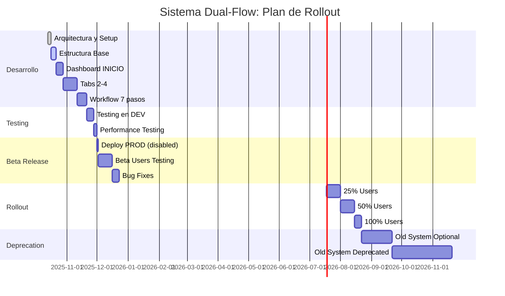

# Análisis de Componentes: Reutilización vs Desarrollo Nuevo

> **Contexto**: Sistema Dual-Flow Paralelo para CuentasSiK
> **Objetivo**: Maximizar reutilización manteniendo separación total
> **Fecha**: Octubre 2025

---

## 🔍 **INVENTARIO DEL SISTEMA ACTUAL**

### Componentes Existentes Analizados

```tsx
// 📂 /components/ui/ (shadcn/ui)
✅ REUTILIZAR TOTAL - No necesita modificación
- Button, Card, Input, Select, Dialog, Tabs, Badge
- Form, Label, Textarea, Checkbox, Switch
- Alert, Skeleton, Progress, Separator
- DropdownMenu, Popover, Sheet, Toast

// 📂 /components/shared/
✅ REUTILIZAR - Componentes de utilidad
- BalanceDisplay.tsx           # Formateo de balances
- ThemeProvider.tsx            # Dark/light mode
- PrivacyProvider.tsx          # Privacy mode
- ThemeToggle.tsx              # Theme switcher
- PrivacyToggle.tsx            # Privacy toggle

⚠️ EVALUAR - Componentes de navegación
- MobileBottomNav.tsx          # Sistema actual (7 tabs)
  → CREAR NUEVO: BottomNavDualFlow.tsx (5 tabs)
- HouseholdSelector.tsx        # Selector hogares
  → REUTILIZAR: Con adaptaciones menores

❌ NO REUTILIZAR - Específicos del sistema actual
- TopBar.tsx                   # Layout específico sistema actual
```

### Server Actions y Utilidades

```tsx
// 📂 /lib/
✅ REUTILIZAR TOTAL
- supabaseServer.ts            # Database queries
- format.ts                    # Formateo fechas/moneda
- utils.ts                     # Utilities generales
- date.ts                      # Manejo fechas
- result.ts                    # Result pattern
- auth.ts                      # Autenticación
- adminCheck.ts                # Checks de admin

✅ REUTILIZAR CON EXTENSIÓN
- query() function             # Base queries
  → EXTENDER: queryOptimized() para materialized views

⚠️ EVALUAR - Actions específicas
/app/app/expenses/actions.ts   # Logic de transacciones
  → CREAR NUEVO: actions optimizados dual-flow
/app/app/contributions/actions.ts # Logic contribuciones
  → CREAR NUEVO: con stored procedures
```

### Hooks y Contexts

```tsx
// 📂 /contexts/
✅ REUTILIZAR
- HouseholdContext.tsx         # Context de household activo

// 📂 Custom Hooks (crear nuevos)
❌ CREAR NUEVO - Específicos dual-flow
- useWorkflowState.ts          # Estado workflow 7 pasos
- usePeriodStatus.ts           # Estado período actual
- useAutoRefresh.ts            # Auto-refresh optimizado
- useDualFlowQueries.ts        # Queries optimizadas
```

---

## 🆕 **COMPONENTES NUEVOS REQUERIDOS**

### Layout y Navegación

```tsx
// 📂 /app/dual-flow/components/
DualFlowLayout.tsx
├── Props: { children, currentStep?, showWorkflowProgress? }
├── Features:
│   ├── Header con período activo
│   ├── Progress de workflow (opcional)
│   ├── Breadcrumbs contextuales
│   └── Footer con navegación
└── Reutiliza: ThemeProvider, PrivacyProvider

BottomNavDualFlow.tsx
├── Props: { activeTab, workflowStep? }
├── Features:
│   ├── 5 tabs optimizadas
│   ├── Indicadores de progress
│   ├── Badge notifications
│   └── Smooth transitions
└── NO reutiliza MobileBottomNav (completamente nuevo)

PeriodHeader.tsx
├── Props: { currentPeriod, workflowStep, completionPercentage }
├── Features:
│   ├── Display período activo
│   ├── Progress visual workflow
│   ├── Days remaining
│   └── Quick period actions
└── Reutiliza: BalanceDisplay, formatters
```

### Workflow Management

```tsx
WorkflowStepper.tsx
├── Props: { currentStep, completedSteps, totalSteps }
├── Features:
│   ├── Visual stepper 1-7
│   ├── Click navigation
│   ├── Validation indicators
│   └── Contextual help
└── Nuevo: Logic específico dual-flow

WorkflowGuide.tsx
├── Props: { step, showTips?, onNext?, onPrev? }
├── Features:
│   ├── Guía contextual por paso
│   ├── Tips y validaciones
│   ├── Next/Previous actions
│   └── Progress saving
└── Nuevo: Content específico workflow

StepValidator.tsx
├── Props: { step, data, onValidation }
├── Features:
│   ├── Validación por paso
│   ├── Error handling
│   ├── Auto-save state
│   └── Prevention logic
└── Nuevo: Validaciones específicas dual-flow
```

### Dashboard Optimizado

```tsx
DashboardGrid.tsx
├── Props: { period, balances, transactions }
├── Features:
│   ├── Grid responsive optimizado
│   ├── Cards contextuales por step
│   ├── Real-time updates
│   └── Quick actions
└── Reutiliza: Card, BalanceDisplay

BalanceOverview.tsx
├── Props: { householdBalance, memberBalances, projections }
├── Features:
│   ├── Household vs personal split
│   ├── Projection calculations
│   ├── Visual indicators
│   └── Drill-down capabilities
└── Extiende: BalanceDisplay existente

QuickActions.tsx
├── Props: { currentStep, availableActions }
├── Features:
│   ├── Context-aware actions
│   ├── Keyboard shortcuts
│   ├── Batch operations
│   └── Smart suggestions
└── Nuevo: Logic específico dual-flow
```

### Transacciones Unificadas

```tsx
TransactionsList.tsx
├── Props: { transactions, filterType, onEdit?, onApprove? }
├── Features:
│   ├── Unified view (household + personal)
│   ├── Real-time filtering
│   ├── Bulk actions
│   └── Inline editing
└── Nuevo: Dual-flow specific logic

AutoPairingPanel.tsx
├── Props: { unpaired, suggestions, onPair }
├── Features:
│   ├── AI-powered suggestions
│   ├── Manual pairing interface
│   ├── Confidence scoring
│   └── Batch pairing
└── Nuevo: Auto-pairing logic específico

ReviewQueue.tsx
├── Props: { pendingReviews, onApprove, onReject }
├── Features:
│   ├── Review workflow
│   ├── Comments system
│   ├── Approval tracking
│   └── Notification system
└── Nuevo: Review logic específico

SettlementCalculator.tsx
├── Props: { period, contributions, balances }
├── Features:
│   ├── Auto-calculation settlement
│   ├── Manual adjustments
│   ├── Transfer simulation
│   └── Payment tracking
└── Nuevo: Settlement logic específico
```

---

## 🔄 **ESTRATEGIA DE REUTILIZACIÓN**

### Patrón de Extensión

```tsx
// Extender componentes existentes sin modificarlos
// 📂 /app/dual-flow/components/shared/

// REUTILIZAR base + EXTENDER funcionalidad
export const BalanceDisplayEnhanced: React.FC<
  BalanceDisplayProps & {
    showProjections?: boolean;
    period?: string;
    workflowStep?: number;
  }
> = ({ showProjections, period, workflowStep, ...props }) => {
  // Logic adicional específico dual-flow
  const projections = showProjections ? calculateProjections() : null;

  return (
    <div className="space-y-2">
      {/* Reutilizar componente base */}
      <BalanceDisplay {...props} />

      {/* Agregar funcionalidad específica */}
      {projections && <ProjectionsDisplay data={projections} />}
    </div>
  );
};
```

### Server Actions Optimizadas

```tsx
// 📂 /app/dual-flow/shared/actions.ts

// REUTILIZAR utilidades base + OPTIMIZAR para dual-flow
import { query, getUserHouseholdId } from '@/lib/supabaseServer';

// Queries optimizadas que aprovechan materialized views
export async function getDashboardDataOptimized() {
  const householdId = await getUserHouseholdId();

  // Usar materialized view en lugar de joins complejos
  const result = await query(
    'SELECT * FROM mv_household_dashboard_current WHERE household_id = $1',
    [householdId],
  );

  return result.rows[0];
}

// Stored procedures para workflows complejos
export async function calculateContributionsOptimized(periodId: string) {
  const result = await query('CALL calculate_member_contributions($1)', [periodId]);

  return result.rows;
}
```

---

## 🎛️ **FEATURE FLAGS IMPLEMENTACIÓN**

### Environment Variables

```bash
# .env.development.local (desarrollo)
ENABLE_DUAL_FLOW=true
DUAL_FLOW_BETA_USERS=user1@example.com,user2@example.com
DUAL_FLOW_DEFAULT_FOR_NEW=false

# .env.production.local (producción)
ENABLE_DUAL_FLOW=false  # Inicialmente deshabilitado
DUAL_FLOW_BETA_USERS=admin@cuentassik.com
DUAL_FLOW_ROLLOUT_PERCENTAGE=0  # 0-100
```

### Feature Flag System

```tsx
// 📂 /lib/featureFlags.ts

export interface FeatureFlags {
  DUAL_FLOW_SYSTEM: boolean;
  DUAL_FLOW_BETA_USERS: string[];
  DUAL_FLOW_ROLLOUT_PERCENTAGE: number;
  DUAL_FLOW_DEFAULT_FOR_NEW: boolean;
}

export const getFeatureFlags = (): FeatureFlags => ({
  DUAL_FLOW_SYSTEM: process.env.ENABLE_DUAL_FLOW === 'true',
  DUAL_FLOW_BETA_USERS: process.env.DUAL_FLOW_BETA_USERS?.split(',') || [],
  DUAL_FLOW_ROLLOUT_PERCENTAGE: parseInt(process.env.DUAL_FLOW_ROLLOUT_PERCENTAGE || '0'),
  DUAL_FLOW_DEFAULT_FOR_NEW: process.env.DUAL_FLOW_DEFAULT_FOR_NEW === 'true',
});

// Check access específico para dual-flow
export async function checkDualFlowAccess(userEmail: string): Promise<boolean> {
  const flags = getFeatureFlags();

  // Feature disabled globally
  if (!flags.DUAL_FLOW_SYSTEM) return false;

  // Beta users always have access
  if (flags.DUAL_FLOW_BETA_USERS.includes(userEmail)) return true;

  // Rollout percentage (hash-based for consistency)
  if (flags.DUAL_FLOW_ROLLOUT_PERCENTAGE > 0) {
    const userHash = hashString(userEmail);
    const userPercentile = userHash % 100;
    if (userPercentile < flags.DUAL_FLOW_ROLLOUT_PERCENTAGE) return true;
  }

  // Check household-level setting
  const household = await getUserHousehold();
  return household?.enable_dual_flow || false;
}

// Consistent hash function
function hashString(str: string): number {
  let hash = 0;
  for (let i = 0; i < str.length; i++) {
    const char = str.charCodeAt(i);
    hash = (hash << 5) - hash + char;
    hash = hash & hash; // Convert to 32-bit integer
  }
  return Math.abs(hash);
}
```

### Database Schema for Feature Control

```sql
-- Agregar a household settings
ALTER TABLE households
ADD COLUMN enable_dual_flow BOOLEAN DEFAULT FALSE,
ADD COLUMN dual_flow_enabled_at TIMESTAMP,
ADD COLUMN dual_flow_enabled_by UUID REFERENCES profiles(id);

-- Table para feature rollout tracking
CREATE TABLE dual_flow_access_log (
  id UUID PRIMARY KEY DEFAULT gen_random_uuid(),
  user_id UUID NOT NULL REFERENCES profiles(id),
  household_id UUID NOT NULL REFERENCES households(id),
  access_granted_at TIMESTAMP DEFAULT NOW(),
  access_method TEXT NOT NULL, -- 'beta_user', 'rollout', 'manual'
  granted_by UUID REFERENCES profiles(id)
);
```

### UI Integration Points

```tsx
// 📂 /app/app/layout.tsx (sistema actual)
// Agregar link condicional al sistema dual-flow

export default async function AppLayout({ children }: { children: ReactNode }) {
  const user = await getCurrentUser();
  const hasAccessToDualFlow = user ? await checkDualFlowAccess(user.email!) : false;

  return (
    <div>
      {/* Header existente */}
      <header>
        {/* ... contenido existente ... */}

        {/* Nuevo: Link condicional a dual-flow */}
        {hasAccessToDualFlow && (
          <div className="ml-4">
            <Button variant="outline" size="sm" asChild>
              <Link href="/app/dual-flow">
                <Zap className="h-4 w-4 mr-2" />
                <span className="hidden sm:inline">Nuevo Sistema</span>
                <Badge variant="secondary" className="ml-2">
                  Beta
                </Badge>
              </Link>
            </Button>
          </div>
        )}
      </header>

      {/* ... resto del layout ... */}
    </div>
  );
}
```

```tsx
// 📂 /app/dual-flow/layout.tsx (sistema nuevo)
// Siempre mostrar link de regreso

export default async function DualFlowLayout({ children }: { children: ReactNode }) {
  return (
    <div>
      <header>
        {/* ... header dual-flow ... */}

        {/* Link de regreso al sistema anterior */}
        <Button variant="ghost" size="sm" asChild>
          <Link href="/app">
            <ArrowLeft className="h-4 w-4 mr-2" />
            Sistema Anterior
          </Link>
        </Button>
      </header>

      {children}
    </div>
  );
}
```

---

## 📊 **PLAN DE MIGRACIÓN GRADUAL**

### Fases de Rollout



### Métricas de Éxito

```tsx
// KPIs para decidir progresión de rollout
interface RolloutMetrics {
  // Adoption
  activeUsersInDualFlow: number;
  workflowCompletionRate: number; // > 80% para continuar rollout
  userRetentionRate: number; // > 90% dual-flow vs anterior

  // Performance
  avgPageLoadTime: number; // < 2s
  errorRate: number; // < 1%
  databaseQueryTime: number; // < 100ms avg

  // Satisfaction
  userFeedbackScore: number; // > 4.0/5.0
  supportTicketsReduction: number; // Reducción vs sistema anterior
  taskCompletionTime: number; // Reducción vs sistema anterior
}
```

---

## ✅ **DECISIONES TOMADAS**

### Naming y Estructura

- **Directorio**: `/app/dual-flow/` (más descriptivo que `/app/v2/`)
- **Navegación**: 5 tabs independientes + reutilizar /app/profile
- **Feature Flags**: Sistema completo con rollout gradual

### Componentes Strategy

- **Reutilizar**: shadcn/ui, utilities, auth, basic providers
- **Extender**: BalanceDisplay, queries básicas
- **Crear nuevo**: Navigation, workflow, dashboard, transacciones

### Database Integration

- **Aprovechar**: ENUMs, materialized views, stored procedures
- **Optimizar**: Queries específicas para dual-flow
- **Mantener**: Compatibilidad total con sistema existente

---

## 🎯 **ESTADO ACTUAL: TODO #1 COMPLETADO**

✅ **Arquitectura definida** - Documento detallado creado
✅ **Componentes analizados** - Reutilización vs desarrollo nuevo
✅ **Feature flags diseñados** - Sistema de rollout gradual
✅ **Plan de migración** - Fases y métricas de éxito

**🔄 SIGUIENTE**: TODO #2 - Estructura Base del Sistema Paralelo

¿Procedemos a crear la estructura base `/app/dual-flow/`?
