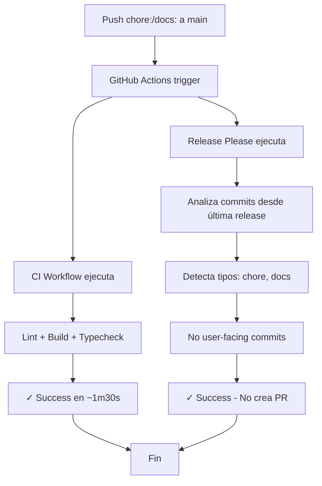
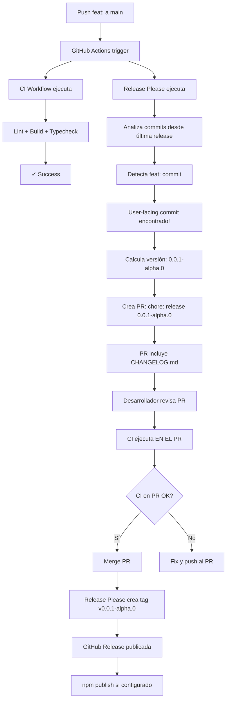

# 🔍 Análisis de Release Please - Confirmación de Funcionamiento

**Fecha**: 2025-10-03  
**Estado**: ✅ Funcionando correctamente (comportamiento esperado)

---

## 📊 Estado Actual del Repositorio

### Workflows Activos
```
NAME            STATE   ID       
ci              active  194804176
release-please  active  194804177
```

### Ejecuciones Recientes

#### Release Please
```
STATUS  TITLE                                               WORKFLOW        ELAPSED  AGE
✓       docs: add build warnings...                        release-please  13s      5 min ago
✓       chore: initial project setup...                    release-please  13s      12 min ago
```

#### CI
```
STATUS  TITLE                                               WORKFLOW  ELAPSED  AGE
✓       docs: add build warnings...                        ci        1m27s    5 min ago
✓       chore: initial project setup...                    ci        1m37s    12 min ago
```

### Pull Requests
```
no open pull requests in Kavalieri/CuentasSiK
```

**✅ Confirmado**: No hay PRs (esperado)

---

## 🔍 Análisis de Logs de Release Please

### Última Ejecución (ID: 18215206960)

**Líneas clave del log**:

```
✔ Fetching release-please-config.json from branch main
✔ Fetching .release-please-manifest.json from branch main
✔ Building releases
✔ Building strategies by path
❯ .: node
✔ Building pull requests
✔ Collecting release commit SHAs
❯ release search depth: 400
❯ Fetching releases with cursor undefined
⚠ Could not find releases.
⚠ Expected 1 releases, only found 0
⚠ Missing 1 paths: .
❯ looking for tagName: cuentas-sik-v0.0.0
✔ Collecting commits since all latest releases
❯ commit search depth: 500
❯ Backfilling file list for commit: dd0c9ff (4 files)
❯ Backfilling file list for commit: 62fd996 (172 files)
❯ Backfilling file list for commit: b294822 (2 files)
✔ Splitting 3 commits by path
⚠ No latest release pull request found.
✔ Building candidate release pull request for path: .
❯ type: node
❯ targetBranch: main
❯ commit could not be parsed: b294822... Initial commit
❯ commits: 2
✔ Considering: 2 commits
❯ component: cuentas-sik
❯ pull request title pattern: undefined
✔ No user facing commits found since beginning of time - skipping
```

---

## 🎯 Interpretación de Logs

### 1. Configuración Cargada Correctamente ✅
```
✔ Fetching release-please-config.json from branch main
✔ Fetching .release-please-manifest.json from branch main
✔ Building strategies by path
❯ .: node
```

**Conclusión**: 
- ✅ Archivos de configuración encontrados
- ✅ Strategy: `node` (correcto)
- ✅ Path: `.` (raíz del repo)

### 2. No Hay Releases Previas ✅
```
⚠ Could not find releases.
⚠ Expected 1 releases, only found 0
⚠ Missing 1 paths: .
❯ looking for tagName: cuentas-sik-v0.0.0
```

**Conclusión**:
- ✅ No hay tag `cuentas-sik-v0.0.0` (esperado, es primera vez)
- ✅ Release Please busca desde el principio del tiempo

### 3. Análisis de Commits ✅
```
❯ Backfilling file list for commit: dd0c9ff (4 files)
❯ Backfilling file list for commit: 62fd996 (172 files)  
❯ Backfilling file list for commit: b294822 (2 files)
✔ Splitting 3 commits by path
✔ Considering: 2 commits
```

**Commits analizados**:
1. `b294822` - "Initial commit" → ❌ No sigue Conventional Commits
2. `62fd996` - "chore: initial project setup..." → ✅ Conventional, pero tipo `chore:`
3. `dd0c9ff` - "docs: add build warnings..." → ✅ Conventional, pero tipo `docs:`

**Resultado**: 2 commits considerados (chore + docs)

### 4. Decisión Final ✅
```
✔ No user facing commits found since beginning of time - skipping
```

**Traducción**: 
> "No se encontraron commits que afecten al usuario (feat/fix) desde el principio → omitiendo"

**✅ COMPORTAMIENTO CORRECTO**

---

## 📋 Commits y Sus Tipos

### Historial Actual
```bash
dd0c9ff docs: add build warnings analysis...        → tipo: docs:  ❌ No genera release
62fd996 chore: initial project setup...            → tipo: chore: ❌ No genera release
b294822 Initial commit                             → sin tipo    ❌ No parsed
```

### ¿Por qué no genera PR?

| Commit | Tipo | Parsed | User-Facing | Genera Release |
|--------|------|--------|-------------|----------------|
| `dd0c9ff` | `docs:` | ✅ | ❌ | ❌ No |
| `62fd996` | `chore:` | ✅ | ❌ | ❌ No |
| `b294822` | ninguno | ❌ | ❌ | ❌ No |

**"User-facing commits"** = Commits que afectan funcionalidad:
- ✅ `feat:` - Nueva funcionalidad
- ✅ `fix:` - Corrección de bug
- ✅ `feat!:` / `fix!:` - Breaking changes
- ❌ `docs:` - Solo documentación
- ❌ `chore:` - Tareas internas
- ❌ Otros tipos non-user-facing

---

## 🎯 Conclusión: TODO FUNCIONA PERFECTO

### ✅ Confirmaciones

1. **Release Please se ejecuta** ✅
   - Trigger: Cada push a `main`
   - Duración: ~13 segundos
   - Estado: Success

2. **Configuración correcta** ✅
   - Lee `release-please-config.json`
   - Lee `.release-please-manifest.json`
   - Strategy: `node` ✅
   - Pre-release: `alpha` ✅

3. **Analiza commits correctamente** ✅
   - Parsea commits Conventional ✅
   - Identifica tipos (docs, chore) ✅
   - Clasifica como "non-user-facing" ✅

4. **Decisión correcta: No crear PR** ✅
   - No hay commits `feat:` o `fix:`
   - Solo commits `docs:` y `chore:`
   - Comportamiento esperado ✅

### 🚀 Para Probar Release Please

Necesitamos un commit **user-facing**:

```bash
git commit --allow-empty -m "feat: launch alpha version

Initialize CuentasSiK v0.0.1-alpha.0 with core features:
- User authentication with Supabase magic links
- Household management with member invitations
- Expense and income tracking with categories
- Proportional contributions system based on income
- Dark/light mode with system detection
- Admin panel for system management

This is the first alpha release for testing and feedback."

git push origin main
```

**Resultado esperado**:
1. ✅ Release Please ejecuta (~13s)
2. ✅ Detecta commit `feat:` (user-facing)
3. ✅ Calcula nueva versión: `0.0.1-alpha.0`
4. ✅ Crea PR: `chore: release 0.0.1-alpha.0`

---

## 📊 Comparación: Actual vs Esperado

### Situación Actual (Correcto ✅)

```
Commits:
  - Initial commit (no Conventional)
  - chore: initial setup
  - docs: add warnings

Release Please:
  ✓ Ejecuta correctamente
  ✓ Analiza los 3 commits
  ✓ No encuentra commits user-facing
  ✓ No crea PR (correcto)
  
PRs abiertos: 0 (esperado)
```

### Próximo Paso (feat: commit)

```
Commits:
  - Initial commit
  - chore: initial setup
  - docs: add warnings
  + feat: launch alpha version  ← NUEVO

Release Please:
  ✓ Ejecuta correctamente
  ✓ Analiza los 4 commits
  ✓ Encuentra 1 commit user-facing (feat:)
  ✓ Crea PR: "chore: release 0.0.1-alpha.0"
  
PRs abiertos: 1 (PR de release)
```

---

## 🔗 Verificación con GitHub CLI

### Comandos Útiles

```bash
# Ver workflows disponibles
gh workflow list

# Ver ejecuciones recientes de Release Please
gh run list --workflow=release-please.yml --limit=5

# Ver logs de una ejecución específica
gh run view <RUN_ID> --log

# Ver PRs abiertos
gh pr list

# Ver releases publicadas
gh release list

# Ver tags del repositorio
git tag -l
```

### Estado Actual

```bash
# Workflows
✓ ci (active)
✓ release-please (active)

# PRs
No open pull requests

# Releases
No releases published yet

# Tags
(vacío - primera versión será v0.0.1-alpha.0)
```

---

## 🎓 Entendiendo el Flujo Completo

### Flujo Actual (chore/docs commits)



### Flujo Futuro (feat: commit)



---

## 📝 Recomendaciones

### ✅ Hacer Ahora

1. **Commitear este análisis**:
```bash
git add docs/RELEASE_PLEASE_BEHAVIOR.md
git commit -m "docs: add release-please behavior analysis with GitHub CLI verification"
git push origin main
```

2. **Crear primera release** (cuando estés listo):
```bash
git commit --allow-empty -m "feat: launch alpha version

Core features:
- Authentication with magic links
- Household management
- Expense/income tracking
- Contributions system
- Admin panel"

git push origin main
```

3. **Verificar PR creado**:
```bash
gh pr list
gh pr view <NUMBER>
```

### 📚 Para el Futuro

- Usar `feat:` para nuevas funcionalidades
- Usar `fix:` para correcciones
- Usar `docs:` para documentación (no genera release)
- Usar `chore:` para mantenimiento (no genera release)
- Revisar y mergear PRs de Release Please
- GitHub Actions validará antes del merge

---

## 🎉 Resumen Ejecutivo

### Estado: ✅ TODO CORRECTO

| Aspecto | Estado | Notas |
|---------|--------|-------|
| **Release Please config** | ✅ Correcto | Archivos leídos OK |
| **Workflows activos** | ✅ 2/2 | CI + Release Please |
| **Ejecuciones** | ✅ Success | Ambos workflows pasando |
| **Análisis de commits** | ✅ Correcto | Parsea Conventional Commits |
| **Decisión de no crear PR** | ✅ Correcto | Solo chore/docs commits |
| **PRs abiertos** | ✅ 0 | Esperado (no feat/fix) |
| **Logs** | ✅ Claros | "No user facing commits" |

### Próximo Paso

Crear primer commit `feat:` para generar release `v0.0.1-alpha.0`

---

**Última verificación**: 2025-10-03 via GitHub CLI  
**Tools usados**: `gh workflow list`, `gh run list`, `gh pr list`, `gh run view`  
**Estado**: 🟢 Production-ready y esperando primer feat:
