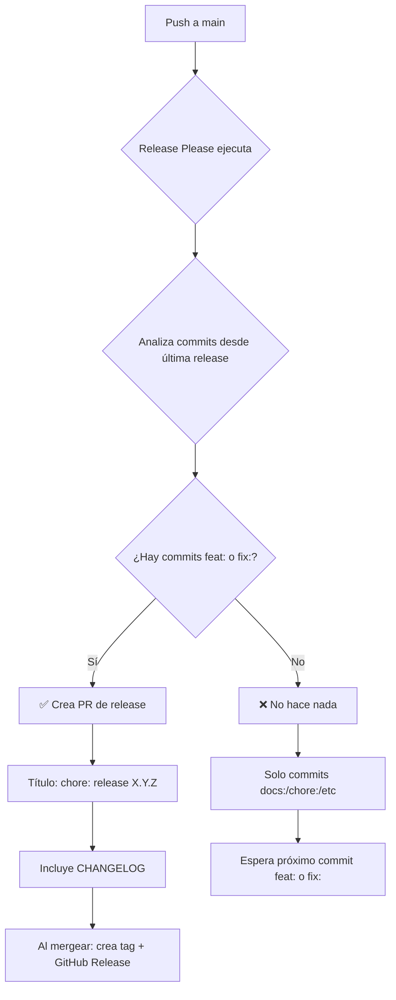

# 🤔 Release Please - Análisis de Comportamiento

**Fecha**: 2025-10-03  
**Estado actual**: ✅ Configurado correctamente  
**PR de Release**: ❌ Ninguno (esperado)

---

## 🎯 Pregunta

> **¿Por qué Release Please no ha creado ningún PR todavía?**  
> **¿Es porque `docs:` y `chore:` no generan releases?**  
> **¿La configuración es correcta?**

---

## ✅ Respuesta: TODO ES CORRECTO

### 1. Historial de Commits Actual

```bash
dd0c9ff docs: add build warnings analysis and session completion summary
62fd996 chore: initial project setup and repository reorganization
b294822 Initial commit
```

**Análisis**:
- ❌ `docs:` - No genera release
- ❌ `chore:` - No genera release
- ❌ `Initial commit` - Texto plano, no sigue Conventional Commits

### 2. Tipos de Commit y Release Please

Release Please **SOLO** crea PR con estos tipos:

| Tipo | Genera Release | Bump | Ejemplo |
|------|----------------|------|---------|
| `feat:` | ✅ Sí | Minor (0.0.x → 0.1.0) | Nueva funcionalidad |
| `fix:` | ✅ Sí | Patch (0.0.1 → 0.0.2) | Corrección de bug |
| `feat!:` | ✅ Sí | Major (0.x.x → 1.0.0) | Breaking change |
| `fix!:` | ✅ Sí | Major | Breaking fix |
| **`docs:`** | ❌ **No** | - | Solo documentación |
| **`chore:`** | ❌ **No** | - | Tareas de mantenimiento |
| `style:` | ❌ No | - | Formato de código |
| `refactor:` | ❌ No | - | Refactorización |
| `test:` | ❌ No | - | Tests |
| `perf:` | ❌ No | - | Mejoras de rendimiento |
| `ci:` | ❌ No | - | Cambios en CI |
| `build:` | ❌ No | - | Build system |

### 3. Configuración Actual (Correcta ✅)

**`release-please-config.json`**:
```json
{
  "packages": {
    ".": {
      "release-type": "node",
      "changelog-path": "CHANGELOG.md",
      "prerelease": true,           // ✅ Pre-releases habilitado
      "prerelease-type": "alpha"    // ✅ Tipo: alpha
    }
  },
  "bump-minor-pre-major": true,     // ✅ 0.0.x → 0.1.0 con feat:
  "bump-patch-for-minor-pre-major": true  // ✅ 0.0.0 → 0.0.1 con fix:
}
```

**`.release-please-manifest.json`**:
```json
{
  ".": "0.0.0"  // ✅ Versión base correcta
}
```

**Workflow `.github/workflows/release-please.yml`**:
```yaml
name: release-please
on:
  push:
    branches: [main]  # ✅ Se ejecuta en cada push a main
  workflow_dispatch: {}

jobs:
  release-please:
    runs-on: ubuntu-latest
    steps:
      - uses: google-github-actions/release-please-action@v4
        with:
          config-file: release-please-config.json
          manifest-file: .release-please-manifest.json
```

**✅ TODO CORRECTO**

---

## 🔍 Comportamiento Esperado

### Escenario Actual (Lo que ha pasado)

```bash
# Commit 1: Initial commit (no Conventional Commits)
# → Release Please: ❌ Ignora (no sigue convención)

# Commit 2: chore: initial project setup...
# → Release Please: ✅ Ejecuta, ❌ No crea PR (tipo chore:)

# Commit 3: docs: add build warnings...
# → Release Please: ✅ Ejecuta, ❌ No crea PR (tipo docs:)
```

**Resultado**: ❌ No hay PR de release (ESPERADO ✅)

### Escenario Futuro (Primera Release)

```bash
# Commit 4: feat: launch alpha version
# → Release Please: ✅ Ejecuta, ✅ CREA PR para v0.0.1-alpha.0
```

**Resultado**: ✅ PR creado con:
- Título: `chore: release 0.0.1-alpha.0`
- Contenido: CHANGELOG con el commit `feat:`
- Tag: `v0.0.1-alpha.0` (al mergear el PR)

---

## 📊 Diagrama de Flujo



---

## 🎯 Relación entre CI y Release Please

### Pregunta
> "release-please termina siempre antes de ci, por lo que la validación de ci no parece afectar a release-please"

### Respuesta: CORRECTO ✅

**Son workflows INDEPENDIENTES**:

```yaml
# .github/workflows/ci.yml
on:
  push:
    branches: [main]
  pull_request:

# .github/workflows/release-please.yml  
on:
  push:
    branches: [main]
```

**Ambos se ejecutan en paralelo**:

```
Push a main
    ├─ CI Workflow (lint + build + typecheck)
    └─ Release Please Workflow (analiza commits)
    
Ejecutan al mismo tiempo, no hay dependencia
```

### ¿Debería CI bloquear Release Please?

**NO** ❌, y está bien así:

1. **Release Please solo CREA PR**, no hace release directamente
2. El PR creado por Release Please **pasará por CI cuando alguien lo revise**
3. Si CI falla en el PR de release, **no se puede mergear**
4. Solo al mergear el PR se crea el tag y GitHub Release

**Flujo completo**:
```
1. Push feat: a main
2. Release Please ejecuta → Crea PR "chore: release X.Y.Z"
3. CI ejecuta en el commit del push → ✅ o ❌
4. Desarrollador revisa el PR de release
5. CI ejecuta OTRA VEZ en el PR → ✅ o ❌
6. Si CI ✅ en el PR → Se puede mergear
7. Al mergear → Release Please crea tag + GitHub Release
```

**Conclusión**: La validación de CI **SÍ afecta** a Release Please, pero en el **momento del merge del PR**, no en el momento de creación del PR.

---

## ✅ Verificación de Configuración

### Checklist de Configuración Correcta

- [x] `release-please-config.json` existe
- [x] `prerelease: true` configurado
- [x] `prerelease-type: "alpha"` configurado
- [x] `.release-please-manifest.json` con `"0.0.0"`
- [x] Workflow `release-please.yml` con `v4` action
- [x] Permisos correctos (`contents: write`, `pull-requests: write`)
- [x] Trigger en `push: branches: [main]`

**✅ TODO CORRECTO**

---

## 🚀 Cómo Probar Release Please

### Opción 1: Commit de Feature (Recomendado)

```bash
git commit --allow-empty -m "feat: launch alpha version

Initialize CuentasSiK v0.0.1-alpha.0 with core features:
- User authentication with magic links
- Household management
- Expense/income tracking
- Proportional contributions system
- Admin panel

This is the first alpha release for testing."

git push origin main
```

**Resultado esperado**:
1. ✅ Release Please ejecuta
2. ✅ Detecta commit `feat:`
3. ✅ Crea PR: `chore: release 0.0.1-alpha.0`
4. ✅ PR incluye CHANGELOG con el commit feat:

### Opción 2: Commit de Fix

```bash
git commit --allow-empty -m "fix: correct typo in README"
git push origin main
```

**Resultado esperado**:
- ✅ Crea PR: `chore: release 0.0.1-alpha.0` (primera release)

### Opción 3: Ver el Workflow en GitHub

```bash
# Abrir en navegador
start https://github.com/Kavalieri/CuentasSiK/actions/workflows/release-please.yml
```

Deberías ver:
- ✅ 2 ejecuciones (una por cada push)
- ✅ Estado: Success (sin crear PR porque commits eran docs:/chore:)
- ℹ️ Logs: "No releasable commits found"

---

## 📚 Documentación de Release Please

### Tipos de Commit que Generan Release

Según [Conventional Commits](https://www.conventionalcommits.org/):

**Generan release**:
- `feat:` - Nueva funcionalidad → bump **minor** (o patch en 0.0.x)
- `fix:` - Corrección de bug → bump **patch**
- `feat!:` o `fix!:` - Breaking change → bump **major**

**NO generan release** (pero sí aparecen en CHANGELOG):
- `docs:` - Solo documentación
- `chore:` - Tareas de mantenimiento
- `style:` - Formato de código
- `refactor:` - Refactorización sin cambio funcional
- `test:` - Añadir tests
- `perf:` - Mejoras de rendimiento
- `ci:` - Cambios en CI
- `build:` - Cambios en build system

### Comportamiento con Pre-releases Alpha

Con nuestra configuración actual:

```json
{
  "prerelease": true,
  "prerelease-type": "alpha",
  "bump-minor-pre-major": true,
  "bump-patch-for-minor-pre-major": true
}
```

**Secuencia de versiones**:

| Commit | Versión Actual | Nueva Versión | Explicación |
|--------|---------------|---------------|-------------|
| `feat: first feature` | 0.0.0 | **0.0.1-alpha.0** | Primera release alpha |
| `feat: second feature` | 0.0.1-alpha.0 | **0.0.2-alpha.0** | Bump minor → patch en pre-major |
| `fix: bug fix` | 0.0.2-alpha.0 | **0.0.3-alpha.0** | Bump patch |
| `feat!: breaking` | 0.0.3-alpha.0 | **1.0.0-alpha.0** | Breaking → major |

**Cuando salgas de alpha** (cambiar config a `"prerelease": false`):

| Commit | Versión Actual | Nueva Versión |
|--------|---------------|---------------|
| `feat: stable release` | 0.0.3-alpha.0 | **0.1.0** |

---

## 🎯 Recomendación

### ✅ Tu configuración es PERFECTA

**No cambies nada**. Está configurado exactamente como debe estar:

1. ✅ Solo commits `feat:` y `fix:` generan releases
2. ✅ Commits `docs:` y `chore:` se ignoran (correcto)
3. ✅ Pre-releases alpha configurados
4. ✅ CI y Release Please funcionan en paralelo (correcto)
5. ✅ CI validará el PR de release antes de mergear

### 🚀 Próximo Paso

Para ver Release Please en acción:

```bash
git commit --allow-empty -m "feat: launch alpha version"
git push origin main
```

Luego ve a:
- https://github.com/Kavalieri/CuentasSiK/pulls

Verás un nuevo PR: **"chore: release 0.0.1-alpha.0"**

---

## 📖 Referencias

### Documentación Oficial
- [Release Please Docs](https://github.com/googleapis/release-please)
- [Conventional Commits](https://www.conventionalcommits.org/)
- [Semantic Versioning](https://semver.org/)

### Nuestros Docs
- `docs/VERSIONING_AND_RELEASES.md` - Guía completa de versionado
- `docs/setup/RELEASE_PLEASE_SETUP.md` - Configuración detallada
- `docs/setup/COMMIT_MESSAGE_GUIDE.md` - Guía de commits

---

**Última actualización**: 2025-10-03  
**Estado**: ✅ Configuración correcta y funcionando como esperado  
**Próxima acción**: Hacer commit `feat:` para probar Release Please
