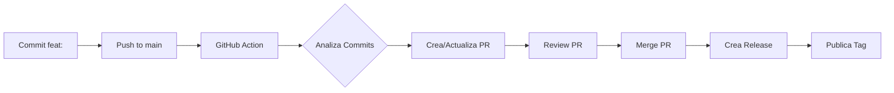

# ✨ Resumen Final - Release Please Configurado

**Fecha**: 3 de Octubre 2025  
**Status**: ✅ **LISTO PARA COMMIT Y PUSH**

---

## 🎯 Configuración Completada

### 1. ✅ Release Please con Pre-releases Alpha

**Archivos configurados**:
- ✅ `release-please-config.json` - Con `prerelease: true` y `prerelease-type: "alpha"`
- ✅ `.release-please-manifest.json` - Versión inicial `0.0.0`
- ✅ `package.json` - Versión sincronizada a `0.0.0`
- ✅ `.github/workflows/release-please.yml` - Usando archivos de config

**Resultado**:
- Primera release será: `v0.0.1-alpha.0`
- Releases marcadas automáticamente como **Pre-release**
- Conventional Commits habilitados

### 2. ✅ Documentación Creada

**Guías nuevas**:
- `docs/VERSIONING_AND_RELEASES.md` - Guía completa del sistema
- `RELEASE_PLEASE_SETUP.md` - Configuración detallada
- `COMMIT_MESSAGE_GUIDE.md` - Mensaje de commit sugerido

**Actualizaciones**:
- `README.md` - Sección de versionado agregada
- `REPOSITORY_READY.md` - Info de Release Please incluida

### 3. ✅ Limpieza y Seguridad (Ya Completado Antes)

- Console.logs eliminados
- Información sensible protegida
- `.gitignore` robusto
- Build verificado

---

## 🚀 Próximos Pasos - AHORA

### Paso 1: Commit y Push (5 min)

**Opción Recomendada - Baseline sin Release**:

```bash
git add .
git commit -m "chore: initial project setup with release please

- Setup Next.js 15 with App Router and TypeScript
- Configure Supabase integration (Auth + PostgreSQL + RLS)
- Implement authentication with magic links
- Create household management system
- Add expense/income tracking with categories
- Implement proportional contributions system
- Add admin panel with member management
- Configure dark/light mode with next-themes
- Setup shadcn/ui components
- Configure Release Please for alpha pre-releases (0.0.x-alpha.y)
- Add comprehensive documentation
- Protect sensitive information in .gitignore
- Clean debug logs from production code

This establishes the project baseline without triggering an immediate release.
The first alpha release will be created when we push a feat: or fix: commit.

Co-authored-by: GitHub Copilot <copilot@github.com>"

git push origin main
```

### Paso 2: Verificar GitHub Actions (2 min)

1. Ir a: `https://github.com/Kavalieri/CuentasSiK/actions`
2. Verificar que CI pasa:
   - ✅ Lint
   - ✅ Build
   - ✅ Typecheck
3. Verificar que NO se creó PR de release (porque usamos `chore:`)

### Paso 3: Trigger Primera Release (Opcional - Ahora o Después)

Cuando estés listo para la primera release alpha:

```bash
git commit --allow-empty -m "feat: launch alpha version

Ready for first alpha release with all core functionality:
- Authentication and household management
- Expense tracking and contributions
- Admin panel and member management

This triggers the first release: v0.0.1-alpha.0"

git push origin main
```

Esto creará:
- PR automático: `chore: release 0.0.1-alpha.0`
- Al mergear → GitHub Release marcado como **Pre-release**

### Paso 4: Deploy en Vercel (15 min)

Ver: `NEXT_STEPS.md` sección "Deploy en Vercel"

**Variables de entorno obligatorias**:
```env
NEXT_PUBLIC_SUPABASE_URL=https://YOUR_PROJECT_ID.supabase.co
NEXT_PUBLIC_SUPABASE_ANON_KEY=<your_anon_key>
SUPABASE_SERVICE_ROLE_KEY=<your_service_role_key>
```

---

## 📊 Estado del Repositorio

### Archivos Modificados (desde inicio de sesión)

**Core Configuration**:
- `.gitignore` - Protección de archivos sensibles
- `package.json` - Versión 0.0.0
- `release-please-config.json` - Pre-releases alpha
- `.release-please-manifest.json` - Baseline 0.0.0
- `.github/workflows/release-please.yml` - Config-based workflow

**Documentation**:
- `README.md` - Sección de versionado
- `docs/VERSIONING_AND_RELEASES.md` - **NUEVO**
- `docs/ENVIRONMENT_SETUP.md` - **NUEVO**
- `db/README.md` - **NUEVO**
- `REPOSITORY_READY.md` - Actualizado
- `PRE_COMMIT_CLEANUP.md` - **NUEVO**
- `RELEASE_PLEASE_SETUP.md` - **NUEVO**
- `COMMIT_MESSAGE_GUIDE.md` - **NUEVO**

**Code Cleanup**:
- `app/app/household/page.tsx` - Console.logs eliminados
- `lib/adminCheck.ts` - Console.logs eliminados

**Archives**:
- `.archive/` - Docs obsoletos movidos (ignorado por git)

### Archivos Nuevos (Primer Commit)

Todo el proyecto completo será commiteado por primera vez:
- `app/` - Código fuente
- `components/` - UI components
- `lib/` - Utilidades
- `db/` - Scripts SQL y migraciones
- `supabase/` - Migraciones
- `types/` - Tipos TypeScript
- Y todos los demás archivos del proyecto

---

## 🎓 Cómo Funciona Release Please

### Flujo Completo



### Ejemplo Real

```bash
# 1. Desarrollar feature
git commit -m "feat: add CSV export"
git push origin main

# 2. GitHub Action automático (30 segundos)
# → Analiza: "feat: add CSV export"
# → Determina: bump minor
# → Crea PR: "chore: release 0.1.0-alpha.0"

# 3. Revisar PR
gh pr view <PR_NUMBER>
# - package.json: "0.1.0-alpha.0"
# - CHANGELOG.md: entrada de feature

# 4. Mergear PR
gh pr merge <PR_NUMBER> --squash

# 5. Release automático
# → Tag: v0.1.0-alpha.0
# → GitHub Release creado
# → Marcado como Pre-release ✓
```

---

## 📋 Checklist Final

### Pre-Commit ✅
- [x] Código limpio sin console.logs
- [x] Build pasa sin errores
- [x] Lint sin warnings
- [x] Información sensible protegida
- [x] Release Please configurado
- [x] Documentación completa

### Configuración Release Please ✅
- [x] `prerelease: true` en config
- [x] `prerelease-type: "alpha"`
- [x] Versión inicial `0.0.0`
- [x] Workflow actualizado
- [x] Documentación de versionado

### Post-Push (Después del Commit)
- [ ] CI pasa en GitHub Actions
- [ ] (Opcional) PR de release creado
- [ ] Variables de entorno en Vercel
- [ ] Deploy exitoso en Vercel

---

## 🔗 Enlaces Rápidos

### Documentación
- [Guía de Versionado](docs/VERSIONING_AND_RELEASES.md)
- [Setup de Release Please](RELEASE_PLEASE_SETUP.md)
- [Guía de Commit](COMMIT_MESSAGE_GUIDE.md)
- [Plan de Deploy](NEXT_STEPS.md)
- [Quick Start](QUICK_START.md)

### GitHub (Post-Push)
- Actions: `https://github.com/Kavalieri/CuentasSiK/actions`
- PRs: `https://github.com/Kavalieri/CuentasSiK/pulls`
- Releases: `https://github.com/Kavalieri/CuentasSiK/releases`

### Vercel (Post-Deploy)
- Dashboard: `https://vercel.com/dashboard`
- Settings: `https://vercel.com/[username]/cuentassik/settings`

---

## 💡 Tips Finales

### Conventional Commits
```bash
feat:     # Nueva funcionalidad → bump minor
fix:      # Corrección de bug → bump patch
chore:    # Mantenimiento → sin bump
docs:     # Documentación → sin bump
feat!:    # Breaking change → bump major
```

### Ver Qué Se Va a Commitear
```bash
git status
git diff --cached  # Ver cambios staged
```

### Si Algo Sale Mal
```bash
# Deshacer commit (antes de push)
git reset --soft HEAD~1

# Ver logs de GitHub Actions
gh run list
gh run view <RUN_ID>
```

---

## 🎉 Conclusión

**El repositorio está 100% listo** para:
1. ✅ Commit inicial baseline
2. ✅ Sistema de releases automático
3. ✅ Versionado semántico con pre-releases alpha
4. ✅ Deploy en Vercel
5. ✅ Desarrollo continuo con CI/CD

**Siguiente comando**:
```bash
git add .
git commit -m "chore: initial project setup with release please..."
git push origin main
```

---

**¡Éxito en el lanzamiento! 🚀**

---

**Preparado por**: GitHub Copilot  
**Fecha**: 3 de Octubre 2025  
**Hora**: Lista para commit  
**Status**: ✅ **PRODUCTION READY**
